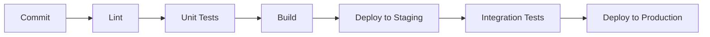

# Automation Dashboard 🚀

A modern, real-time test automation dashboard built with Flask and HTMX. This application provides a sleek, responsive interface for monitoring test automation results across your CI/CD pipeline.

**Live Demos:**
- [Production Environment](http://automationdashboard.supersqa.com/)
- [Staging Environment](http://staging.automationdashboard.supersqa.com/)


## Features ✨

- **Real-Time Updates**: Live monitoring of test results with automatic 30-second refresh cycles
- **Smart Status Tracking**: 
  - 🟢 Green: 100% pass rate
  - 🟡 Yellow: 90-99% pass rate
  - 🔴 Red: <90% pass rate
- **Interactive Charts**: Visual representation of test pass rates over time
- **Responsive Design**: Seamless experience across desktop and mobile devices
- **Dark Mode Support**: Eye-friendly interface for all lighting conditions

## Technology Stack 🛠

### Backend
- **Flask**: Lightweight WSGI web application framework
- **Gunicorn**: Production-grade WSGI HTTP Server
- **MySQL**: Robust data storage for test results
- **Python 3.8+**: Modern Python features and type hints

### Frontend
- **HTMX**: Dynamic content updates without JavaScript
- **Chart.js**: Interactive and responsive charts
- **Tailwind CSS**: Utility-first CSS framework for modern designs

### Infrastructure & DevOps
- **Digital Ocean**: VPS hosting for staging and production
- **Docker**: Containerization for consistent environments
- **GitLab CI/CD**: Automated testing and deployment pipeline
- **Nginx**: Web server and reverse proxy
- **Healthcheck Endpoints**: Production-ready monitoring

## CI/CD Pipeline 🔄

Our robust CI/CD pipeline automates testing, building, and deployment:



### Pipeline Stages

1. **Pre-Deploy**
   - Code quality checks with pylint
   - Automated error detection
   - Dependency validation

2. **Staging Deployment**
   - Automated deployment to staging server
   - Environment configuration
   - Health check verification

3. **Integration Testing**
   - Automated UI tests with Selenium
   - API endpoint validation
   - Performance benchmarking

4. **Production Deployment**
   - Zero-downtime deployment
   - Automated rollback capability
   - Post-deployment health checks

## Infrastructure Architecture 🏗

The application is deployed across multiple environments:

```
                           ┌─────────────────┐
                           │   GitLab CI/CD  │
                           └────────┬────────┘
                                   │
                   ┌───────────────┴───────────────┐
                   │                               │
          ┌────────▼─────────┐           ┌────────▼─────────┐
          │  Staging Server  │           │Production Server  │
          │   (Digital Ocean)│           │  (Digital Ocean)  │
          └────────┬────────┘           └────────┬─────────┘
                   │                              │
          ┌────────▼────────┐           ┌────────▼─────────┐
          │     Nginx       │           │      Nginx       │
          └────────┬────────┘           └────────┬─────────┘
                   │                              │
          ┌────────▼────────┐           ┌────────▼─────────┐
          │    Gunicorn     │           │    Gunicorn      │
          └────────┬────────┘           └────────┬─────────┘
                   │                              │
          ┌────────▼────────┐           ┌────────▼─────────┐
          │  Flask App      │           │   Flask App      │
          └────────┬────────┘           └────────┬─────────┘
                   │                              │
          ┌────────▼────────┐           ┌────────▼─────────┐
          │     MySQL       │           │      MySQL       │
          └────────────────┘            └─────────────────┘
```

## Deployment Configuration 🚀

### Server Setup

Each environment (staging/production) runs on a Digital Ocean VPS with:
- Ubuntu 20.04 LTS
- 2GB RAM
- 2 vCPUs
- 50GB SSD

### Nginx Configuration

```nginx
server {
    listen 80;
    server_name automationdashboard.supersqa.com;

    location / {
        proxy_pass http://localhost:9098;
        proxy_set_header Host $host;
        proxy_set_header X-Real-IP $remote_addr;
    }
}
```

### Gunicorn Service

```ini
[Unit]
Description=Automation Dashboard Gunicorn Service
After=network.target

[Service]
User=ubuntu
WorkingDirectory=/opt/automationdashboard
Environment="PATH=/opt/automationdashboard/venv/bin"
ExecStart=/opt/automationdashboard/venv/bin/gunicorn -w 4 -b 0.0.0.0:9098 'automationdashboard:app'

[Install]
WantedBy=multi-user.target
```

## Getting Started 🚀

1. **Clone the Repository**
   ```bash
   git clone https://github.com/yourusername/automationdashboard.git
   cd automationdashboard
   ```

2. **Set Up Environment**
   ```bash
   python -m venv venv
   source venv/bin/activate  # On Windows: venv\Scripts\activate
   pip install -e .[dev]
   ```

3. **Configure Environment Variables**
   ```bash
   export DATA_STORAGE=database  # or 'file'
   export DB_HOST=localhost
   export DB_USER=your_user
   export DB_PASSWORD=your_password
   export DB_PORT=3306
   ```

4. **Run the Application**
   ```bash
   # Development
   python automationdashboard/run.py

   # Production
   gunicorn -w 4 -b 0.0.0.0:9098 'automationdashboard:app'
   ```

## Docker Deployment 🐳

```bash
# Build the image
docker build -t automation-dashboard .

# Run the container
docker run -d -p 9098:9098 \
  -e DATA_STORAGE=database \
  -e DB_HOST=db \
  automation-dashboard
```

## Contributing 🤝

1. Fork the repository
2. Create a feature branch
3. Commit your changes
4. Push to the branch
5. Open a Pull Request

## Performance Optimizations ⚡

- Efficient database queries
- Caching where appropriate
- Minimal JavaScript footprint
- Optimized asset delivery
- Smart component updates
- Load balanced worker processes

## Security Considerations 🔒

- SQL injection prevention
- XSS protection
- CSRF protection
- Secure headers
- Environment variable management
- Regular security updates
- Automated vulnerability scanning

## License 📄

This project is licensed under the MIT License - see the [LICENSE](LICENSE) file for details.

---

Built with ❤️ by Admas Kinfu

*Note: This dashboard is part of a larger automation testing infrastructure and showcases modern web development practices, real-time data processing, and production-ready deployment configurations. The application is actively used in production environments for monitoring test automation results.*


