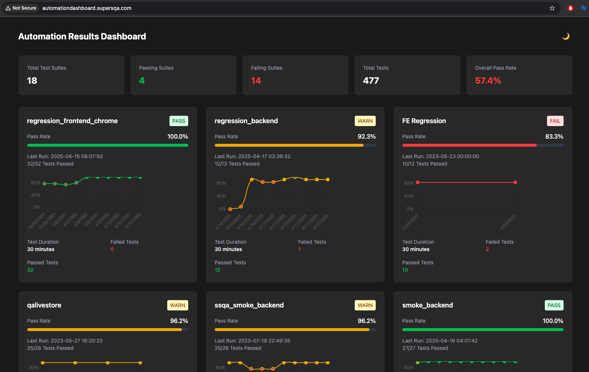
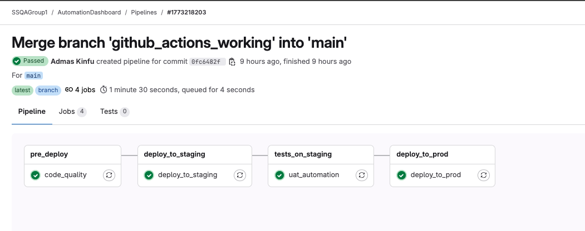
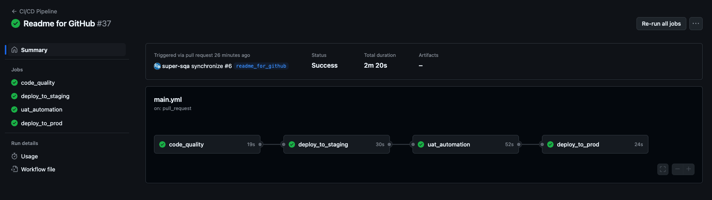

# Automation Dashboard 🚀

[](https://gitlab.com/yourusername/automationdashboard)
[](https://github.com/yourusername/automationdashboard)

A modern, real-time test automation dashboard built with Flask and HTMX, providing a sleek, responsive interface for monitoring test automation results across CI/CD pipelines.

> **Note**: This project is maintained in both GitLab and GitHub as part of an educational initiative to demonstrate CI/CD pipeline implementations across different platforms. The codebase is identical in both repositories, with platform-specific CI/CD configurations.

**Live Demos:**
- [Production Environment](http://automationdashboard.supersqa.com/)
- [Staging Environment](http://staging.automationdashboard.supersqa.com/)




## Repository Information 📚

This project is maintained in both GitLab and GitHub to demonstrate:
- Different CI/CD pipeline implementations
- Platform-specific automation capabilities
- Cross-platform deployment strategies
- Educational comparison of Git hosting platforms

### Repository Links
- **GitLab**: [automationdashboard](https://gitlab.com/yourusername/automationdashboard)
- **GitHub**: [automationdashboard](https://github.com/yourusername/automationdashboard)

## Features ✨

- **Real-Time Updates**: Live monitoring of test results with automatic 30-second refresh cycles
- **Smart Status Tracking**: 
  - 🟢 Green: 100% pass rate
  - 🟡 Yellow: 90-99% pass rate
  - 🔴 Red: <90% pass rate
- **Interactive Charts**: Visual representation of test pass rates over time
- **Responsive Design**: Seamless experience across desktop and mobile devices
- **Dark Mode Support**: Eye-friendly interface for all lighting conditions

## Technology Stack 🛠

### Backend
- **Flask**: Lightweight WSGI web application framework
- **Gunicorn**: Production-grade WSGI HTTP Server
- **MySQL**: Robust data storage for test results
- **Python 3.10+**: Modern Python features and type hints

### Frontend
- **HTMX**: Dynamic content updates without JavaScript
- **Chart.js**: Interactive and responsive charts
- **Tailwind CSS**: Utility-first CSS framework for modern designs

### Infrastructure & DevOps
- **Digital Ocean**: VPS hosting
- **GitLab CI/CD**: Automated testing and deployment pipeline
- **Nginx**: Web server and reverse proxy
- **Healthcheck Endpoints**: Production-ready monitoring

## CI/CD Pipeline 🔄

The project implements CI/CD pipelines on both GitLab and GitHub, showcasing different approaches to automation:

### GitLab CI/CD
The GitLab pipeline consists of three main stages:




1. **Pre-Deploy**
   ```yaml
   code_quality:
     stage: pre_deploy
     script:
       - pip3 install .[dev]
       - pylint ./automationdashboard --recursive=true -E
   ```
   - Runs on merge requests and main/develop branches
   - Performs code quality checks
   - Validates Python syntax and style

2. **Deploy to Staging**
   ```yaml
   deploy_to_staging:
     stage: deploy_to_staging
     variables:
       ENVIRONMENT: staging
       PORT: 9099
     script:
       - bash deploy.sh
   ```
   - Triggered on develop and main branches
   - Deploys to staging environment
   - Runs health checks

3. **Deploy to Production**
   ```yaml
   deploy_to_prod:
     stage: deploy_to_prod
     variables:
       ENVIRONMENT: prod
       PORT: 9098
     script:
       - bash deploy.sh
   ```
   - Triggered only on main branch
   - Deploys to production environment
   - Verifies application health

### GitHub Actions
The GitHub workflow provides a similar pipeline with a different interface and configuration approach:



```yaml
name: CI/CD Pipeline
on:
  push:
    branches: [ main, develop ]
  pull_request:
    branches: [ main, develop ]

jobs:
  test:
    runs-on: ubuntu-latest
    steps:
      - uses: actions/checkout@v2
      - name: Set up Python
        uses: actions/setup-python@v2
      - name: Install dependencies
        run: |
          python -m pip install --upgrade pip
          pip install .[dev]
      - name: Run tests
        run: |
          pytest
```

<div style="padding: 1em; background-color: rgba(0, 123, 255, 0.1); border-left: 4px solid #007bff; margin: 1em 0;">
💡 **Note**: The screenshots above show the actual pipeline interfaces from both platforms. While the configurations are similar in functionality, the visual representation and workflow management differ between GitLab and GitHub, highlighting the unique features of each platform.
</div>

## Infrastructure Architecture 🏗

The application utilizes a cost-effective single VPS setup that hosts both staging and production environments:

```
                     ┌─────────────────┐
                     │  GitHub Actions │
                     └────────┬────────┘
                             │
                     ┌───────▼────────┐
                     │  Digital Ocean  │
                     │      VPS       │
                     └───────┬────────┘
                             │
                     ┌───────▼────────┐
                     │     Nginx      │
                     │ Reverse Proxy  │
                     └───┬─────┬──────┘
                         │     │
            ┌────────────▼─┐ ┌─▼────────────┐
            │   Staging    │ │  Production   │
            │  Port: 9099  │ │  Port: 9098   │
            └──────────────┘ └──────────────┘
```<div style="padding: 1em; background-color: rgba(255, 149, 0, 0.1); border-left: 4px solid #ff9500; margin: 1em 0;">
⚠️ Running production and staging environments on the same server is not recommended for enterprise applications. This setup is chosen purely for cost-efficiency in a personal project context, with environments isolated through separate ports and Nginx configurations.
</div>

## Getting Started 🚀

1. **Clone the Repository**
   ```bash
   # From GitLab
   git clone https://gitlab.com/yourusername/automationdashboard.git
   
   # From GitHub
   git clone https://github.com/yourusername/automationdashboard.git
   
   cd automationdashboard
   ```

2. **Set Up Environment**
   ```bash
   python -m venv venv
   source venv/bin/activate  # On Windows: venv\Scripts\activate
   pip install -e .[dev]
   ```

3. **Configure Environment Variables**
   ```bash
   export DATA_STORAGE=database  # or 'file'
   export DB_HOST=localhost
   export DB_USER=your_user
   export DB_PASSWORD=your_password
   export DB_PORT=3306
   ```

4. **Run the Application**
   ```bash
   # Development
   python automationdashboard/run.py

   # Production
   gunicorn -w 4 -b 0.0.0.0:9098 'automationdashboard:app'
   ```

## Performance Optimizations ⚡

- Efficient database queries
- Minimal JavaScript footprint
- Optimized asset delivery
- Smart component updates

## Security Considerations 🔒

- SQL injection prevention
- XSS protection
- CSRF protection
- Secure headers
- Environment variable management

---

Built with ❤️ by Admas Kinfu ([SuperSQA.com](http://supersqa.com))

*Note: This dashboard showcases modern web development practices, real-time data processing, and production-ready deployment configurations. The application actively monitors test automation results in production environments.*


